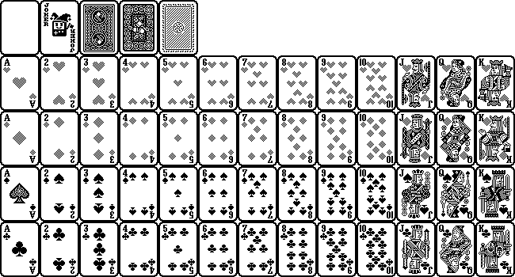

# poker thing or something
shoutout eva   
igtchaiimtwt

## asset info
this is just notes for me    
cards png was made for free nicely by someone [here](https://devforum.play.date/t/playing-card-deck-imagetable-free-for-your-card-game/994)     
### dims
the card sheet is:     
| W   | H     |
|-----|------|
| 13  | 5 cards  |
| 650 | 350 pix  |
| 50  | 70 pix/card |

### layout

|  | 0    | 1      | 2    | 3    | 4    | 5    | 6    | 7    | 8    | 9    | 10   | 11  | 12  | 13  |
|----|------|--------|------|------|------|------|------|------|------|------|------|-----|-----|-----|
| 0  | - | Jk  | b1 | b2 | b3 |  -   |  -   |  -   |  -   |  -   |  -   |  -  |  -  |  -  |
| 1  | Ah   | 2h     | 3h   | 4h   | 5h   | 6h   | 7h   | 8h   | 9h   | 10h  | Jh   | Qh  | Kh  |  -  |
| 2  | Ad   | 2d     | 3d   | 4d   | 5d   | 6d   | 7d   | 8d   | 9d   | 10d  | Jd   | Qd  | Kd  |  -  |
| 3  | As   | 2s     | 3s   | 4s   | 5s   | 6s   | 7s   | 8s   | 9s   | 10s  | Js   | Qs  | Ks  |  -  |
| 4  | Ac   | 2c     | 3c   | 4c   | 5c   | 6c   | 7c   | 8c   | 9c   | 10c  | Jc   | Qc  | Kc  |  -  |

### img

